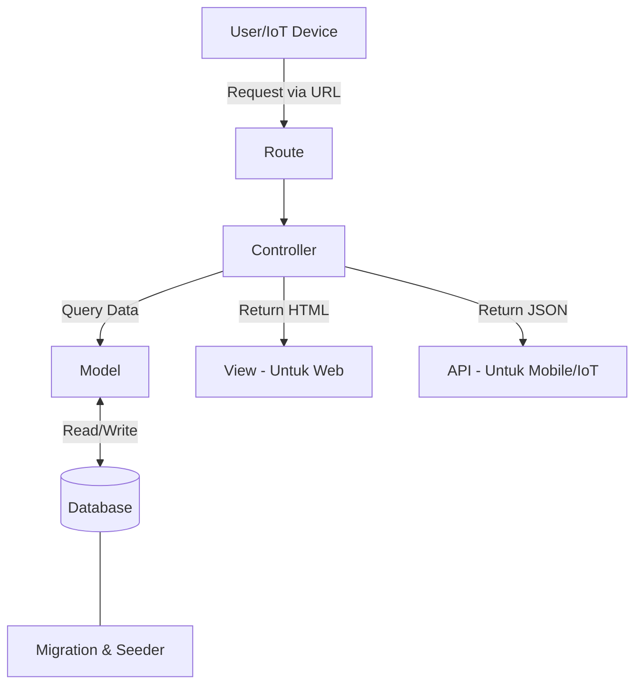

# Panduan Pengembangan Aplikasi Monitoring Ikan (Laravel)

Dokumentasi ini dirancang untuk pemula guna memahami alur pengembangan fitur dalam aplikasi ini, mulai dari pembuatan database hingga penampilan data di aplikasi/API.

---

## 1. Migrasi (Migration)
**Lokasi:** `database/migrations/`

### Apa itu?
Migrasi adalah *version control* untuk database Anda. Alih-alih membuat tabel secara manual di phpMyAdmin, kita menuliskannya dalam kode PHP.

### Cara Kerja:
- Setiap file migrasi mendefinisikan struktur tabel (nama kolom, tipe data seperti `string`, `integer`, `boolean`, dll).
- **Perintah Penting:** 
  - `php artisan make:migration create_namatabel_table`: Membuat file migrasi baru.
  - `php artisan migrate`: Menjalankan migrasi (membuat tabel di database).
  - `php artisan migrate:rollback`: Membatalkan migrasi terakhir.

### Nyambungnya ke mana?
Migrasi terhubung langsung ke **Database**. File ini menentukan kolom apa saja yang bisa disimpan oleh **Model**.

---

## 2. Seeder
**Lokasi:** `database/seeders/`

### Apa itu?
Seeder digunakan untuk mengisi database dengan data awal atau data contoh (dummy). Sangat berguna saat baru pertama kali install aplikasi agar database tidak kosong.

### Cara Kerja:
- Kita mendefinisikan data apa saja yang ingin dimasukkan ke tabel tertentu.
- **Perintah Penting:** 
  - `php artisan make:seeder NamaSeeder`: Membuat file seeder baru.
  - `php artisan db:seed --class=NamaSeeder`: Menjalankan seeder spesifik.
  - `php artisan migrate:fresh --seed`: Menghapus semua tabel, migrasi ulang, dan isi data seeder sekaligus.

### Nyambungnya ke mana?
Seeder mengisi **Database** berdasarkan struktur yang dibuat di **Migrasi**.

---

## 3. Model
**Lokasi:** `app/Models/`

### Apa itu?
Model adalah jembatan antara kode PHP kita dengan tabel di database (menggunakan ORM bernama Eloquent). Setiap tabel biasanya memiliki satu Model.

### Contoh (`app/Models/Kolam.php`):
Jika kita punya tabel `kolams`, maka modelnya adalah `Kolam`.

### Nyambungnya ke mana?
- **Ke Migrasi/Database:** Model tahu kolom apa saja yang ada di tabel.
- **Ke Controller:** Controller menggunakan Model untuk mengambil atau menyimpan data.

---

## 4. Controller
**Lokasi:** `app/Http/Controllers/`

### Apa itu?
Controller adalah "otak" dari fitur Anda. Ia menerima permintaan (request) dari user, memproses data menggunakan Model, lalu mengirimkan hasilnya ke View atau API.

### Alur Kerja:
1. User mengakses URL (Route).
2. Route memanggil fungsi di **Controller**.
3. Controller memanggil **Model** untuk ambil data.
4. Controller mengirim data tersebut ke **View** (untuk web) atau **JSON** (untuk API).

### Nyambungnya ke mana?
- **Ke Route:** Menentukan URL mana yang ditangani.
- **Ke Model:** Mengambil/mengolah data.
- **Ke View/API:** Menampilkan hasil akhir.

---

## 5. View (Blade)
**Lokasi:** `resources/views/`

### Apa itu?
View adalah bagian yang dilihat langsung oleh user (Antarmuka/UI). Laravel menggunakan engine bernama **Blade** yang memungkinkan kita menulis kode PHP di dalam HTML dengan mudah (contoh: `@if`, `@foreach`).

### Nyambungnya ke mana?
View menerima data dari **Controller** dan menampilkannya kepada user dalam bentuk halaman web.

---

## 6. Pembuatan API
**Lokasi Route:** `routes/api.php`
**Lokasi Controller:** `app/Http/Controllers/Api/`

### Apa itu?
API (Application Programming Interface) digunakan agar aplikasi lain (seperti Android atau perangkat IoT) bisa berkomunikasi dengan server kita. API tidak mengirimkan halaman HTML (View), melainkan data mentah berformat **JSON**.

### Cara Kerja:
- Definisi URL di `routes/api.php` (otomatis memiliki prefix `/api/`).
- Menggunakan Controller khusus di folder `Api` agar logika web dan API terpisah.

---

## Struktur Spesifik Project Ini

Dalam project **Monitoring Ikan** ini, berikut adalah beberapa file kunci yang sering Anda modifikasi:

### A. Fitur Monitoring (Data Sensor)
- **Model:** `app/Models/Monitoring.php` - Menyimpan data pH, Suhu, TDS, dll.
- **Controller (Web):** `app/Http/Controllers/MonitoringController.php` - Menampilkan riwayat data di web.
- **Controller (API):** `app/Http/Controllers/Api/MonitoringController.php` - Menerima data dari alat IoT (ESP32/Arduino).
- **View:** `resources/views/monitoring/index.blade.php` - Tabel riwayat sensor.

### B. Fitur Controlling (Threshold/Ambang Batas)
- **Model:** `app/Models/Threshold.php` - Menyimpan batas minimal/maksimal sensor untuk kontrol otomatis.
- **Controller:** `app/Http/Controllers/ThresholdController.php` - Mengatur batas dari web.
- **API:** `app/Http/Controllers/Api/ControllingController.php` - Alat IoT mengambil data batas ini untuk menentukan kapan menyalakan pompa/heater.

### C. Fitur Kas (Keuangan)
- **Model:** `app/Models/Pemasukan.php` & `app/Models/Pengeluaran.php`
- **Controller:** `app/Http/Controllers/KasController.php` - Logika input uang masuk/keluar.

---

## Tips Tambahan: Cara Membuat Fitur Baru
Jika Anda ingin menambah fitur baru (misal: fitur "Pakan"), ikuti urutan ini:
1. Buat **Migration**: `php artisan make:migration create_pakans_table`
2. Buat **Model**: `php artisan make:model Pakan`
3. Buat **Controller**: `php artisan make:controller PakanController`
4. Tambah **Route** di `routes/web.php` atau `routes/api.php`
5. Buat **View** di `resources/views/pakan/index.blade.php`

---

## Rangkuman Alur (Konektivitas)

### Tips untuk Pemula:
1. Mulai dengan **Migrasi** untuk menentukan data apa yang ingin disimpan.
2. Buat **Model** agar Laravel bisa mengenali tabel tersebut.
3. Buat **Controller** untuk menulis logika fiturnya.
4. Daftarkan di **Route** agar bisa diakses lewat browser.
5. Buat **View** atau **API Response** untuk menampilkan datanya.
